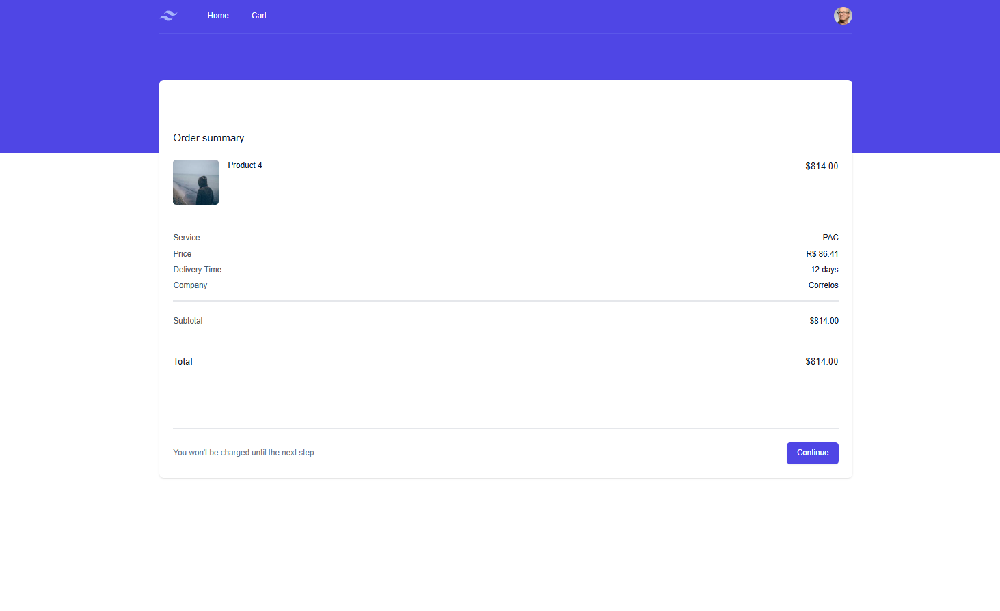

# E-Commerce Project Overview

This project showcases the user interface of an e-commerce website, from the homepage to the checkout process. Below is a brief description of each key page in the user flow, accompanied by screenshots.

## Homepage

The homepage introduces the user to the main categories of products and any ongoing promotions. The layout is designed to highlight popular items and provide easy navigation.

## Product Page

On the product page, users can view detailed information about a specific product, including images, price and description.

## Shopping Cart Page

The shopping cart page shows all the products added to the cart. Users can adjust quantities, remove items, or proceed to checkout.

## Checkout Page

The checkout page allows users to review their before proceeding with their purchase.

## Order Confirmation Page

After completing the checkout process, users are directed to the order confirmation page where they can see a summary of their order and receive confirmation of the successful transaction.

## Profile Page

On the profile page, users can manage their account details, including personal information and shipping addresses.

